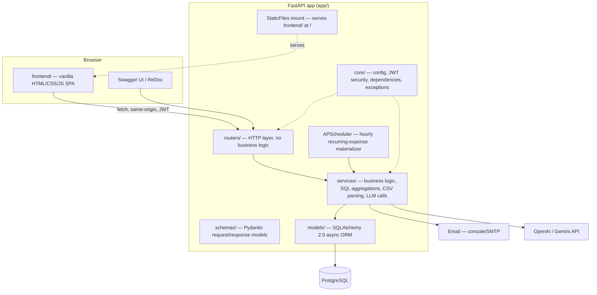

# SpendWise

[](https://github.com/Jenuineaf/SpendWise/actions/workflows/ci.yml)
[](https://www.python.org/downloads/release/python-3120/)
[](https://fastapi.tiangolo.com/)
[](LICENSE)

**Live demo:** [spendwise-7ov1.onrender.com](https://spendwise-7ov1.onrender.com) *(free-tier hosting — first load after inactivity can take ~30-60s to wake up)*

A production-quality expense tracker — multi-user, budget-aware, with CSV bank-statement
import, SQL-driven analytics, an LLM budgeting advisor, monthly PDF reports, and a full web UI.

Backend: **Python 3.12, FastAPI, PostgreSQL, SQLAlchemy 2.0 (async)**.
Frontend: **vanilla HTML/CSS/JS**, no build step, served by FastAPI itself.

## Features

- **Auth** — JWT access + refresh tokens, bcrypt password hashing, every resource scoped to its owner
- **Expenses** — CRUD with pagination, date-range and category filtering
- **Categories** — 10 sensible defaults seeded per user at signup, custom categories supported
- **Budgets** — monthly, per category; every response shows spend vs. budget for that month
- **Recurring expenses** — rule-based (amount, category, cadence), materialized automatically by an hourly APScheduler job, with catch-up for missed cycles
- **CSV import** — robust parser for UPI/bank statement exports (multiple encodings, aliased headers, debit/credit split columns), keyword auto-categorizer that learns from your corrections
- **Analytics** — month-over-month trend, category breakdown, top merchants, daily spend — all computed with SQL aggregations, not Python loops
- **Budget alerts** — email (console backend in dev) when a category crosses 80% / 100% of its budget
- **LLM advisor** — ask spending questions in plain English, answered from your real data; provider-agnostic (OpenAI or Gemini), graceful fallback with no API key configured
- **Savings goals** — target + deadline, progress projected from income vs. recent spending
- **Data export** — CSV of raw expenses, and a formatted monthly PDF report
- **Web UI** — dashboard, expenses, budgets, categories, recurring rules, CSV import, analytics
  charts, savings goals, an advisor chat, and settings — a single-page app in `frontend/`,
  served same-origin by FastAPI (no separate frontend deploy, no CORS)

## Architecture



Layering rule: routers only parse requests and call services; all business logic (ownership
checks, budget math, categorization, alert thresholds) lives in `services/`. See
[PHASENOTES.md](PHASENOTES.md) for the reasoning behind specific design decisions, phase by
phase.

## API docs

Once running:

- Web app: `http://localhost:8000/`
- Swagger UI: `http://localhost:8000/docs`
- ReDoc: `http://localhost:8000/redoc`
- OpenAPI schema: `http://localhost:8000/openapi.json`

## Setup

### Prerequisites

- Python 3.12
- Docker + Docker Compose (for local Postgres) — or a local PostgreSQL 16+ instance

### 1. Clone and configure

```bash
cp .env.example .env
# edit .env: set SECRET_KEY to a real random value, adjust DATABASE_URL if not using Docker
```

### 2. Start PostgreSQL

```bash
docker compose up -d
```

### 3. Install dependencies

```bash
python -m venv .venv
source .venv/bin/activate  # Windows: .venv\Scripts\activate
pip install -r requirements-dev.txt
```

### 4. Run migrations

```bash
alembic upgrade head
```

### 5. Run the app

```bash
uvicorn app.main:app --reload
```

Visit `http://localhost:8000/` for the web app, or `http://localhost:8000/docs` for the API
docs. No separate frontend build/install step — `frontend/` is plain static files served
directly by this same process.

### 6. Run tests

Tests need their own database (`spendwise_test` by default — see `tests/conftest.py`):

```bash
pytest -v
```

### 7. Lint

```bash
ruff check .
```

## Configuration

All config is env-driven via `pydantic-settings` (see `app/core/config.py` and `.env.example`).
Notable ones:

| Variable | Purpose |
|---|---|
| `DATABASE_URL` | Postgres connection string (`postgresql+asyncpg://...`) |
| `SECRET_KEY` | JWT signing key — set a real random value outside dev |
| `LLM_PROVIDER` | `openai` or `gemini`; advisor falls back gracefully if the matching API key is unset |
| `EMAIL_BACKEND` | `console` (logs, default for dev) or `smtp` |

## Deployment

- **Dockerfile** — multi-stage build, non-root user, runs `alembic upgrade head` before serving
- **render.yaml** — one-command deploy to Render (web service + managed Postgres)
- **.github/workflows/ci.yml** — ruff + pytest against a real Postgres service container on every push/PR

## Roadmap

Shipped in this build (Phases 1–6): auth, expense/budget/recurring core, CSV import + analytics,
LLM advisor + alerts + savings goals + export, tests + CI + Docker, and a full web UI.

Not yet built — natural next steps:

- Token revocation / real logout (current JWTs are stateless until expiry)
- Multi-currency support
- Shared/household budgets (currently strictly single-owner)
- Push/webhook notifications alongside email alerts
- Bank API integration (Account Aggregator) instead of manual CSV import
- Per-test DB transaction rollback in the test suite (currently shares one schema per session, isolated by per-test random users — fine for correctness, not the fastest possible test run)
- Real client-side routing (`history.pushState`) for the frontend — currently one URL with JS view-toggling, so there's no deep-linking or shareable per-page URLs
